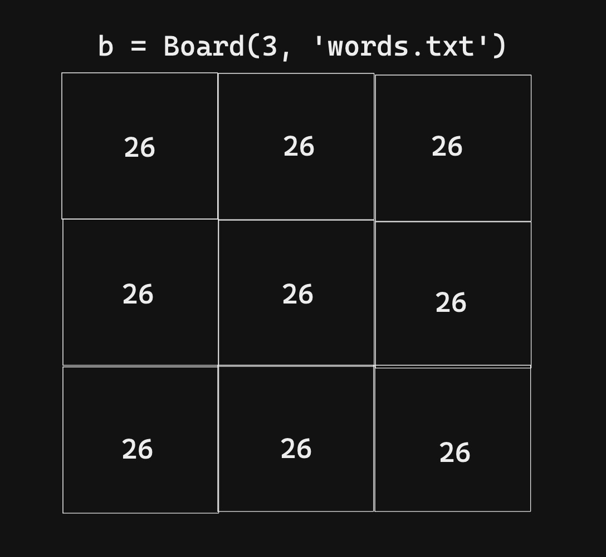

# Cross - Gen (WIP)
### A Distinct Crossword Generator Built With Wave Function Collapse
[Wave function collapse](https://en.wikipedia.org/wiki/Wave_function_collapse) is a concept first originated to describe superpositions in quantum mechanics. It describes the process in which a quantum system is "observed" by the external world and collapses into a single measurable state. 
This idea has been used as an algorithm for procedural generation of complex images, audio, text, and other forms of media. In this project, I use a custom version of this algorithm written in python to automatically generate unique crosswords.

## How to run

To quickly generate a crossword with default difficulty settings, simply run:
```
python main.py
```

You can pass in an option for board difficulty by including "easy/e", "medium/m", or "hard/h". 

```
python main.py medium
```

If you wish to see more information on the generation process, you can set the `DEBUG` flag to True at the top of `engine/generator.py`.

## How It Works
A board of a random shape (picked from `engine/shapes.txt`) is instatiated with each cell starting with max "entropy" of 26 (for each potential letter in the alphabet).



The board then goes through a series of "collapsing" where a random cell with minimum entropy is observed and collapsed to a random letter of it's potential options. The board is then checked to update the potential characters for each cell. 

If a configuration of letters is reached where a cell has 0 potential characters left to choose from, the engine will backtrack and reset the the cells vertical/horizontal to it. Once every cell is filled with a letter that completes a board of valid words, the collapsing stops and the resulting puzzle is printed to the console.

## Special Thanks
- Rachael Tatman 
	- [Word Database](https://www.kaggle.com/datasets/rtatman/english-word-frequency)
- The Coding Train on Youtube
	- [Introduction to wfc](https://www.youtube.com/watch?v=rI_y2GAlQFM&t=504s)